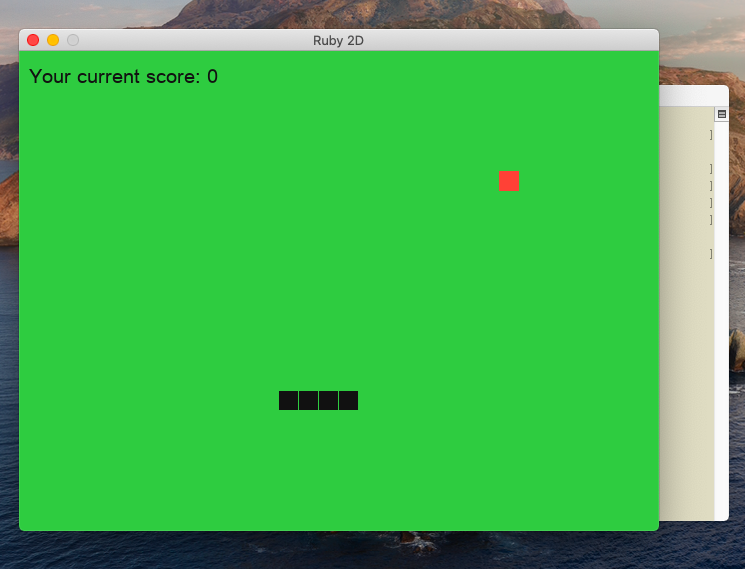
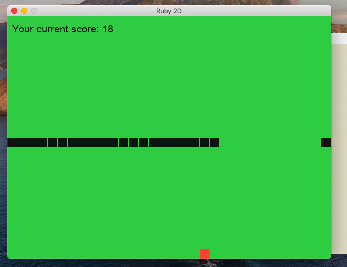
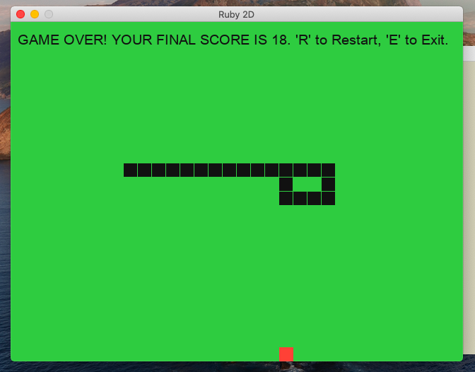

# Snake Game

This is the original Snake Game programmed in Ruby. I watched a tutorial on how to complete yesterday on Youtube by Mario Visic and thought I would tackle the project today. I was able to complete it and here is the final draft of the code. The game is created using ruby2d, and works just like the original. 

This was a fantastic way to challenge myself from viewing the material the day before to completing the task from scatch without any video help!

